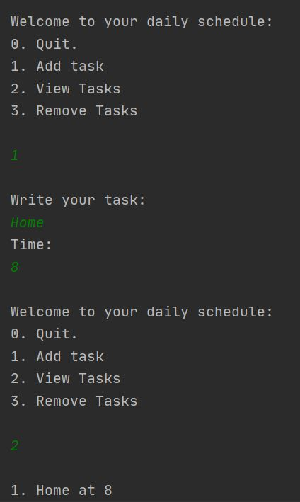
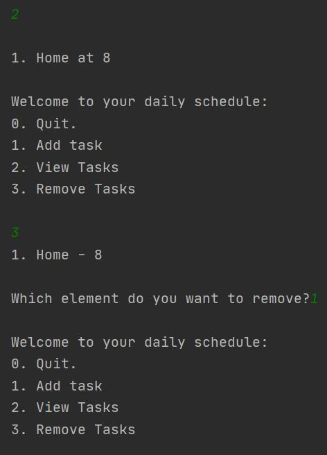
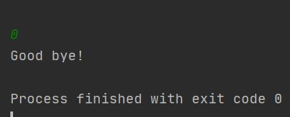

#Standard List

Description
* The upgraded version of To Do List
* Added ending message as well as better formatting for the option display

Requirements
* Intelli J Idea
* Windows 10

Useful links
* [Kotlin.org](https://kotlinlang.org/api/latest/jvm/stdlib/kotlin.collections/-list/index-of.html)
* [Programiz.com](https://www.programiz.com/kotlin-programming/while-loop)

Screenshot

